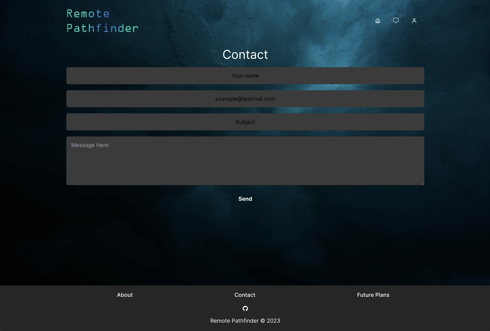

# Remote-Pathfinder
  

## Description
 This is a MERN stack application built to help users find remote jobs. Our application pulls jobs in using Googles API. Employers can also create an account and post jobs directly to the site. Users will create their accounts and be able to apply and save different job postings to their list. This job search application is built specifically for people looking to work from home.

## Table of contents
  * [Installation](#installation)
  * [Usage](#usage)
  * [Display](#display)
  * [License](#license)
  * [Contributors](#contributors)
  * [Test](#test)
  * [Questions?](#questions)

## Installation
  Use the command "npm i" to install neccessary packages to run this application.

## Usage
  Link to Heroku goes here

## Display
  
  
  
  
  

## License
  https://mit-license.org/

## Contributors
  * Russell Heady ii
  * Travis Rivera
  * Landon Deroin
  * Wyatt Bensman

## Test
  N/A

## Questions?

### Emails
  * Landon Deroin - Kingkonathefirst@gmail.com
  * Travis Rivera - Travis3214@yahoo.com
  * Russell Heady ii - Rdheadyii@gmail.com
  * Wyatt Bensman - Wyattbensman5@gmail.com

  ### Repository
  * https://github.com/KingKonaTheFirst/Remote-Pathfinder
